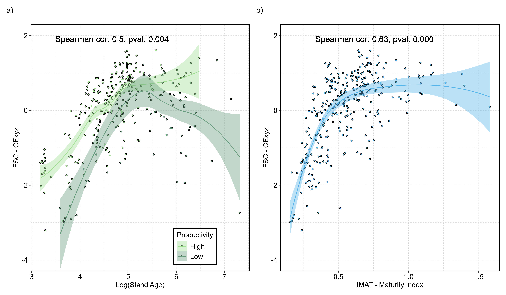

# LIDAR-BASED FOREST STRUCTURAL COMPLEXITY INDICES ARE NOT PROXIES FOR OLD-GROWTH FORESTS

**Authors:**\
Luizmar de Assis Barrosa, Karen Priceb, Camile Sothec, Xavier Llanoa, Juan Pablo Ramírez-Delgadoa, Alemu Gonsamod, Chris Johnsona, Michelle Ventera, Oscar Ventera

a *University of Northern British Columbia, 3333 University Way, Prince George, V2N 4Z9, British Columbia, Canada*\
b *Independent Researcher, 1355 Malkow Road, Smithers, BC V0J 2N7, Canada*\
c *Planet Labs PBC, San Francisco, 695571, California, USA*\
d *McMaster University, 1280 Main Street West, Hamilton, L8S 4K1, Ontario, Canada*

---

## Abstract

Forest structural complexity (FSC) summarizes the three-dimensional (3D) arrangement of forest structural elements, which directly influence both species’ habitat availability and canopy-atmosphere interactions (e.g., light interception, moisture, and gas exchange). While often considered synonymous with forest succession, particularly old-growth, factors such as site quality, topography, climate, and disturbance history also shape FSC.

We aimed to investigate whether old-growth forests are inherently characterized by high levels of structural complexity. We assessed six LiDAR-derived FSC indices (e.g., Canopy Rugosity, Canopy Entropy, Foliage Diversity) against 13 field-measured old-growth structural attributes (e.g., stand age, biomass, vertical complexity, top height) from 343 plots across Vancouver Island, British Columbia, Canada.

Random forest models with 5-fold cross-validation tested the FSC indices’ performance and assessed redundancies. FSC was then compared across age, forest maturity index (IMAT - aggregation of 13 old-growth structural attributes, except age), and productivity (site index).

Although highly redundant and strongly correlated with Canopy Rugosity and Median Absolute Deviation of Height, Canopy Entropy (CExyz) emerged as the strongest FSC index (R² = 0.57 ± 0.08), with top tree height, live tree volume, max DBH, and age as key predictors. FSC plateaued in all top three predictors: Top tree height > 45m, live tree volume > 900 m³/ha, and DBH > 250 cm.

FSC peaked in late-mature forests (~210 years) but declined in older stands, particularly under low-productivity (site index < 20m). Productive old-growth forests retained higher FSC (> 250 years and site index > 20m). The IMAT index had a stronger relationship with FSC than age but also showed a plateau around 0.75 on a scale from 0 to 1.5.

These findings suggest that FSC is more linked to biomass and productivity than forest age alone, making it valuable for describing forest development but not synonymous with old-growth status.

---

## Index Terms
Forest structural complexity; Canopy Rugosity; Old-growth forests; LiDAR indices; Site productivity

---

## Main Result

**Figure 1** Scatter plot of FSC vs a) log transformed stand age and b) forest maturity index (IMAT). 

# R Scripts Description:
**- 1_BC_tree_data.R**\
  Pre-processing of British Columbia tree-level field inventory data and calculation of old-growth structural attributes\
**- 2_plot_level_comp_metrics.R**\
  Calculation of LiDAR-derived Forest Structural Complexity (FSC) indices at plot level\
**- 3_comp_met_analysis.R**\
  Random forest analysis of field-measured old-growth structures vs LiDAR FSC indices\
**- 4_Anova_analysis_Full.R**\
  Comparison of stand age groups, Maturity clusters, and Productivity vs FSC

# Data Summaries:
**data_Full.csv**: Field and LiDAR metrics unfiltered\
**data_75.csv**: Field and LiDAR metrics filtered with a voxel size of 0.4 m, resulting in a drop of 25% on the point cloud density\
**data_50.csv**: Field and LiDAR metrics filtered with a voxel size of 0.75 m, resulting in a drop of 50% on the point cloud density
